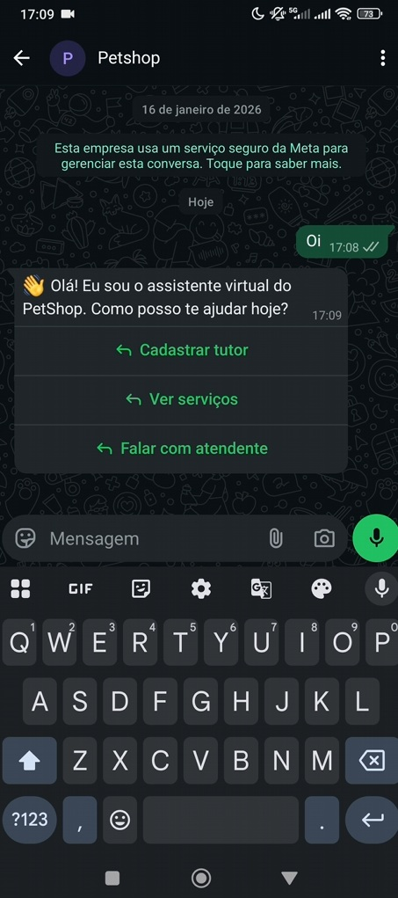

🦸‍♂️ Chatbot WhatsApp para Agendamento de Consultas

Projeto desenvolvido para treinar a implementação de arquitetura limpa (Clean Architecture), Integração Contínua (CI) e automação de testes com o uso de WhatsApp Business API. O bot permite o agendamento de consultas, registros de tutores e pets, além de permitir o reagendamento e cancelamento de consultas via WhatsApp.

Destaques: integração com WhatsApp, fluxos automatizados, teste de integração com Testcontainers, e CI no GitHub Actions.

✨ Features

Arquitetura limpa (Clean Architecture) para garantir a escalabilidade e manutenção do código.

Integração com WhatsApp para agendamento de consultas, registro de tutores e pets.

Fluxo de agendamento de consultas com confirmação e coleta de informações (nome, endereço, pet).

Fluxo de reagendamento e cancelamento de consultas.

Testes automatizados com JUnit e Mockito para garantir o bom funcionamento de todos os fluxos.

Integração contínua (CI) configurada no GitHub Actions, executando testes automaticamente a cada commit.

📦 Requisitos

Java 17+

Spring Boot

Docker (para rodar o banco de dados PostgreSQL)

GitHub Actions (para CI)

Testcontainers (para testes com banco de dados em containers)

Dados do WhatsApp (ID, access token e outros parâmetros necessários)


Instalação rápida

Clonar o repositório
```bash
git clone https://github.com/renatopassos/chatbot-whatsapp.git
cd chatbot-whatsapp
```

Configuração do WhatsApp:

Crie um arquivo .env na raiz do projeto.

Adicione as variáveis necessárias para autenticação com o WhatsApp API:

WHATSAPP_PHONE_NUMBER_ID,
WHATSAPP_ACCESS_TOKEN,
WHATSAPP_API_VERSION,
WHATSAPP_BASE_URL


Isso permitirá que o chatbot se conecte corretamente com a API do WhatsApp.

Configurar o Banco de Dados (PostgreSQL) com Docker:
```bash
docker-compose up -d
```

Rodar o projeto
```bash
./mvnw spring-boot:run
```

Rodar os testes
```bash
./mvnw test
```

Ou, se preferir executar testes específicos:
```bash
./mvnw test -Dtest=RescheduleAppointmentUseCaseTest
```

Execução no WhatsApp

Após a configuração, ao executar o bot, você poderá interagir com ele via WhatsApp, realizando agendamentos, registros de pets, tutores e realizando outras interações.

🖼️ Demonstração

Video do projeto em funcionamento: https://youtube.com/shorts/YItowSGhdAE


